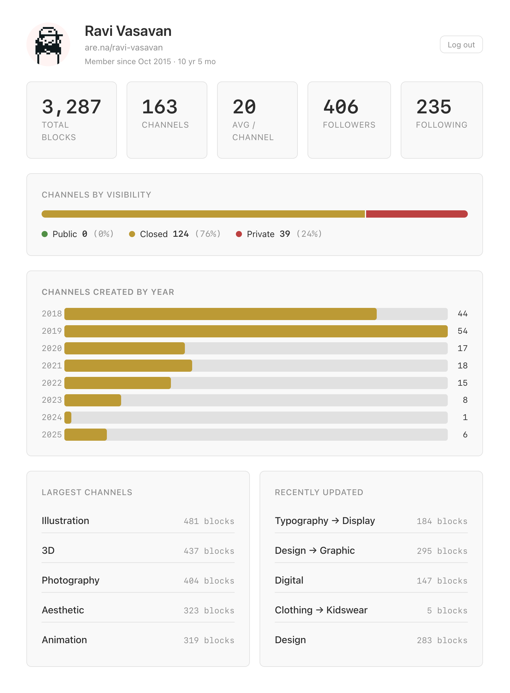

# Arena Stats

A personal dashboard for your [Are.na](https://www.are.na) account. See your blocks, channels, followers, and more at a glance.

Built with React + Vite. Uses the Are.na v3 API.



## Features

- Total blocks, channels, average blocks per channel, followers, and following counts
- Account age and membership date
- Channel breakdown by visibility (public / closed / private)
- Channel creation timeline — horizontal bar chart by year
- Top 5 largest channels by block count
- Top 5 recently updated channels
- Responsive layout for mobile

## Setup

```
npm install
npm run dev
```

Open the app and enter your Are.na personal access token to log in. You can find your token at [are.na/settings/personal-access-tokens](https://www.are.na/settings/personal-access-tokens).

Your token is stored in `localStorage` and never leaves your browser (API calls are proxied through the Vite dev server).

## Build

```
npm run build
npm run preview
```
