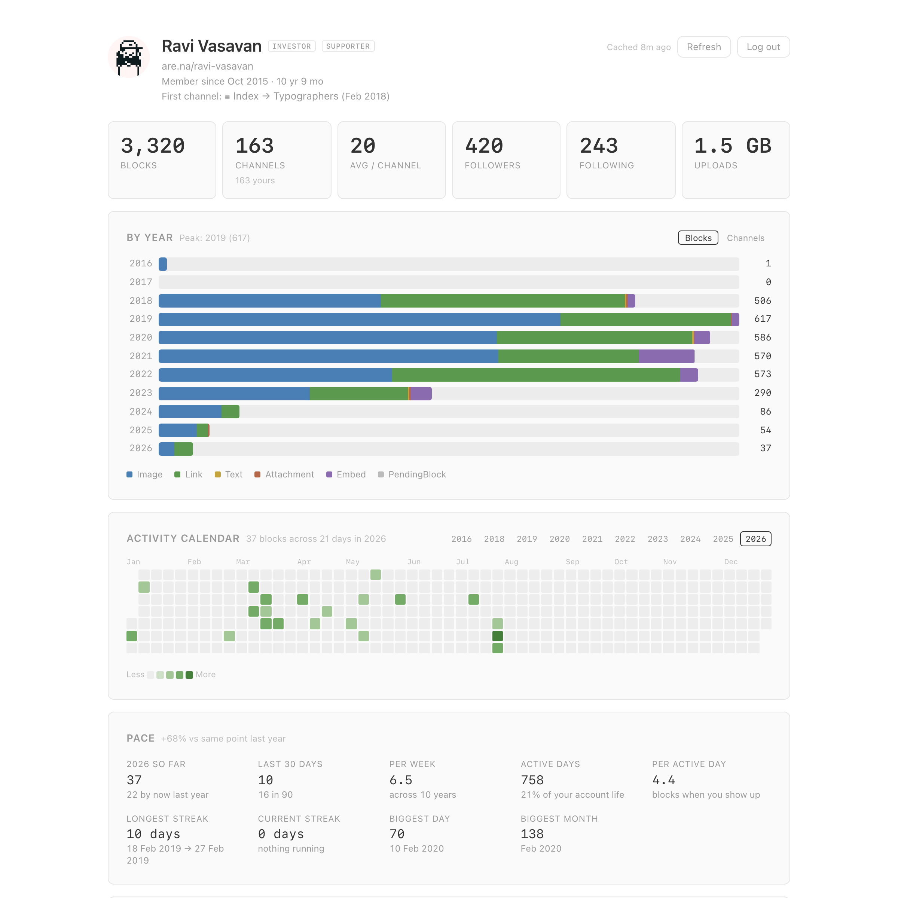

# Arena Stats

A personal dashboard for your [Are.na](https://www.are.na) account. Everything the v3 API will tell you about your own collecting, in one page.

Built with React + Vite. Uses the [Are.na v3 API](https://api.are.na/v3/openapi).



## What it shows

**Blocks** — every block you've made is fetched and analysed locally:

- Blocks created per year, stacked by type (image / link / text / attachment / embed)
- A GitHub-style activity calendar, one year at a time
- Every month since you joined, plus day-of-week and hour-of-day rhythm
- Composition: type mix, public vs private, titled vs untitled, words written in text blocks, image orientation
- Where it comes from: top link domains and uploaded file types
- Storage footprint: total bytes uploaded, split by type, and your largest files
- Pace: this year vs the same point last year, last 30/90 days, blocks per week, active days, longest and current streaks, biggest day and month

**Channels**

- Created per year, and by visibility (public / closed / private)
- Owned by you vs shared with you vs owned by a group
- Size distribution, median and mean, empty channels, nested channel-in-channel links
- Channels gone quiet (untouched 6 months / 1 year)
- Largest, most recently updated, and longest-running channels

**People**

- Followers, following broken down into people / channels / groups, and your follower ratio
- Your most frequent channel collaborators
- Groups you belong to, and your newest followers
- Recent activity from your network

**Milestones** — joined, first channel, first block, longest-running channel, newest channel, most recent block, on one timeline.

## Setup

```
npm install
npm run dev
```

Open the app and enter your Are.na personal access token to log in. You can find your token at [are.na/settings/personal-access-tokens](https://www.are.na/settings/personal-access-tokens).

Your token is stored in `localStorage` and never leaves your browser. In dev, API calls are proxied through the Vite dev server; in production they go straight to `api.are.na`, which allows cross-origin reads.

## How it handles the API

Fetching every block means one request per 100 blocks, so:

- **Rate limiting is self-imposed.** Are.na allows 30/120/300/600 requests per minute for guest/free/premium/supporter accounts. The app reads your tier from `/v3/me` and stays at 80% of that budget, with `Retry-After`-aware backoff on a 429. (The `X-RateLimit-*` headers aren't in the CORS expose list, so the budget can't be read directly in production.)
- **Results are cached** in `localStorage` for 24 hours, trimmed to just the fields the stats need. "Refresh" clears the cache and re-fetches.
- **The page fills in progressively** — channels first, then blocks streaming in with a progress bar, then the social graph.
- **Block analysis is capped at 25,000 blocks.** Past that, the totals stay accurate but the charts are based on your most recent 25,000.

## Build

```
npm run build
npm run preview
```
